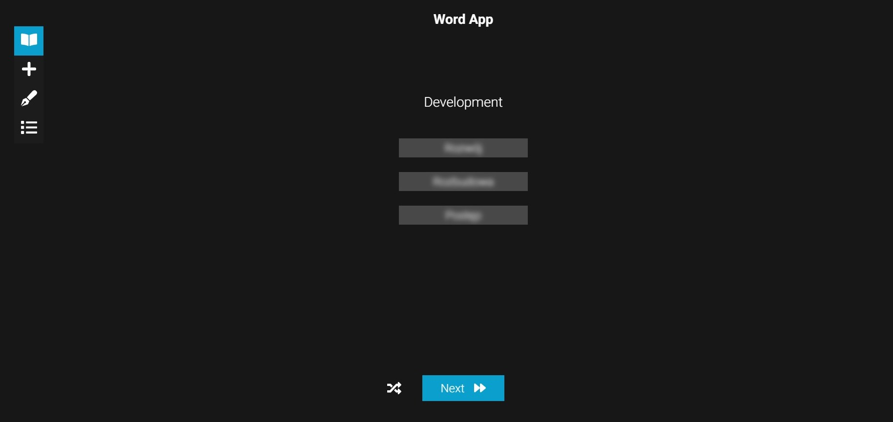

# Word App

Try it now! [https://szymii-word-app.netlify.app/add-word](https://szymii-word-app.netlify.app/add-word)

## Create your own dictionary

- Add and remove words
- Menage your words list
- Train vocabulary and spelling
- Make notes

## Built with

- [React](https://reactjs.org/)
  - [React Icons](https://react-icons.github.io/react-icons)
  - [React Context API](https://reactjs.org/docs/context.html)
  - [React modal](https://www.npmjs.com/package/react-modal)
  - [React String Replace](https://github.com/iansinnott/react-string-replace)
- [Styled Components](https://styled-components.com/)
- [PWA](https://web.dev/progressive-web-apps/)
